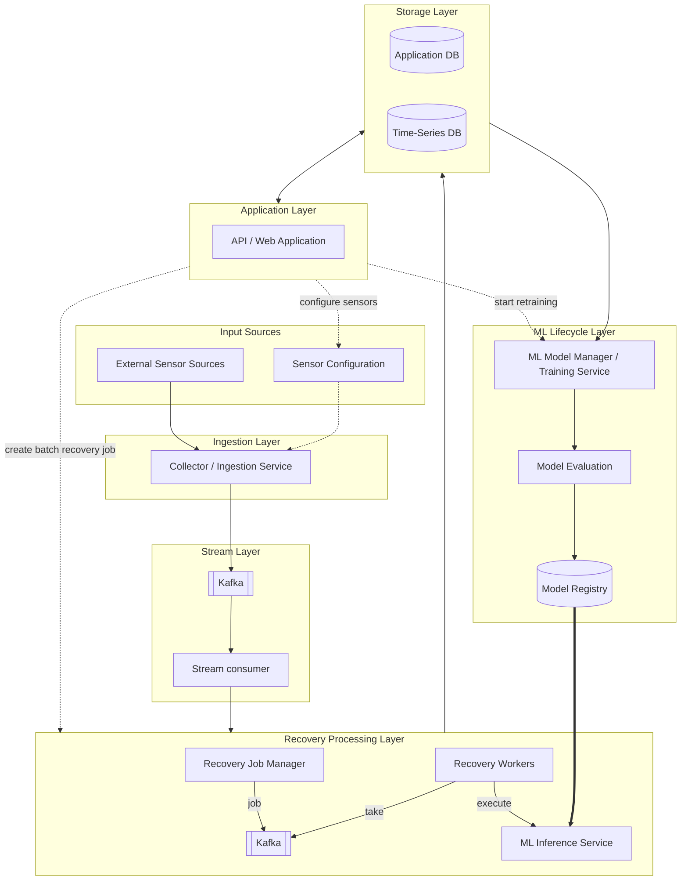

# Overview

End-to-end simple time series' missing data recovery system, which work in several scenarios:
 - batch recovery;
 - stream data recovery in soft real-time;
 - ML models registry retrain mechanism;
 - Connect new sensor;

 # System architecture
