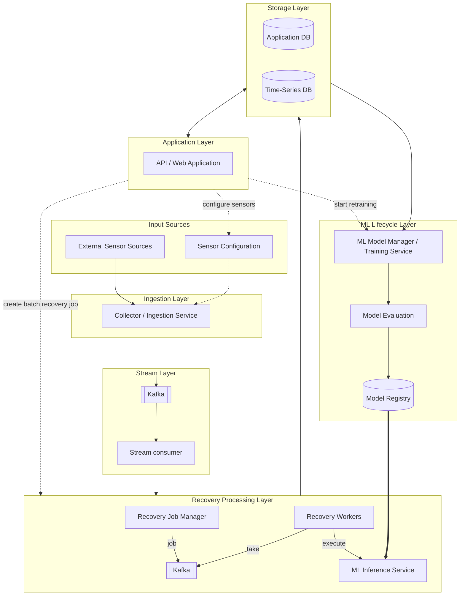
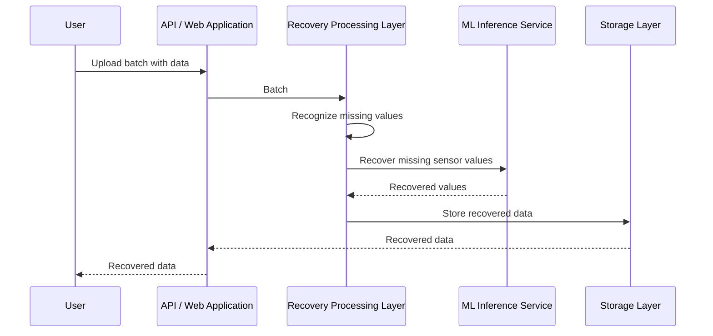
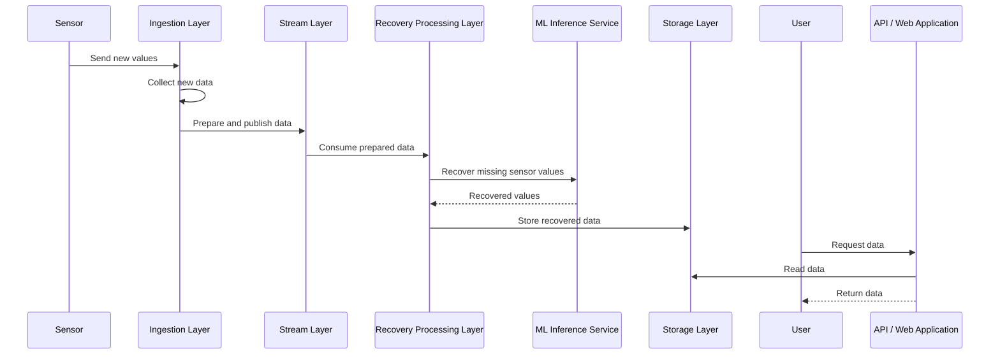
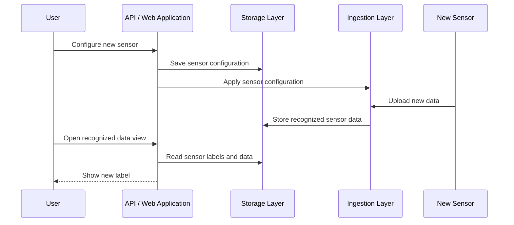
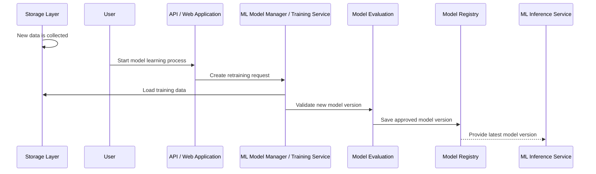

# Overview

End-to-end simple time series' missing data recovery system, which work in several scenarios:
 - batch recovery;
 - stream data recovery in soft real-time;
 - ML models registry retrain mechanism;
 - Connect new sensor;

 # System architecture

# Scenarios

## Scenario 1. Batch recovery of history data

1. User upload batch with data.
2. Prepare data.
3. Recognize missing values.
4. Process of recovering missing sensor's values.
5. Store resuilt into storage.
6. User get data with recovery missing values.

## Scenario 2. Stream recovery data

1. Sensor sends new values.
2. Collect new data.
3. Prepare data.
4. Process of recovering missing sensor's values.
5. Store resuilt into storage.
6. User get data with recovery missing values.

## Scenario 3. Add new sensor

1. User configure new sensor.
2. New sensor starts upload new data into system.
3. User get new label for view recognized data.

## Scenario 4. Repeat model learning process

1. There is new data in storage.
2. Administator start model learning process
3. New model version saved into registry.

